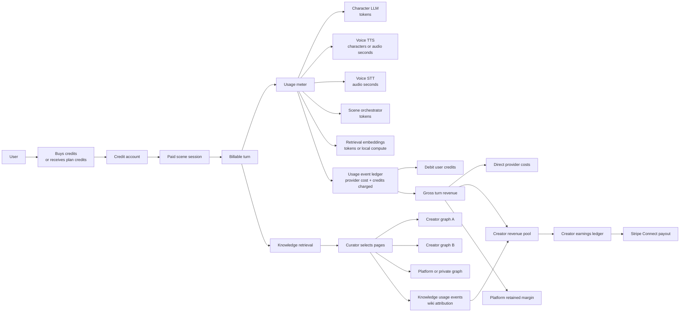

# Odyssey Credit + Creator Revenue Model

This paper describes a credit-based user billing model with creator revenue sharing for knowledge graphs. It is designed around the current Odyssey architecture: sessions, turns, wiki-backed knowledge graphs, curator-selected pages, and provider usage events.

## 1. Core Business Model

Users do not pay directly for raw LLM tokens, TTS characters, STT minutes, or orchestration calls. They buy or receive **credits**. Odyssey meters the actual provider usage internally, converts that usage into a user-facing credit charge, and then attributes part of the paid turn value to creators whose knowledge graphs were selected into model context.

The main rule:

> Creators earn when their published knowledge graph is selected into paid AI context during a billable session turn.

This keeps the model measurable and audit-friendly. A graph does not earn merely because it is attached to a character. It earns when its pages are actually retrieved, curated, and sent to the model.

## 2. Visual Model



## 3. Ledger Model

The operational session tables should stay useful for debugging, replay, and analytics. The financial source of truth should be append-only ledgers.

### User Credit Ledger

Tracks credits purchased, granted, debited, refunded, or adjusted.

| Field | Meaning |
| --- | --- |
| `userId` | User being charged or credited |
| `type` | `purchase`, `grant`, `debit`, `refund`, `adjustment` |
| `amountCredits` | Positive or negative credit movement |
| `stripeEventId` | Payment or refund source, when applicable |
| `usageEventId` | Linked usage event for debits |
| `createdAt` | Ledger timestamp |

### Usage Event Ledger

Records the internal cost and billable credit charge for each provider-facing operation.

| Field | Meaning |
| --- | --- |
| `sessionId` / `turnId` | Attribution back to the product experience |
| `operation` | `character.llm`, `scene.orchestrator`, `voice.tts`, `voice.stt`, `embedding` |
| `provider` / `model` | Actual vendor and model used |
| `rawUnits` | Tokens, characters, audio seconds, request count |
| `vendorCostUsd` | Estimated or invoice-backed cost |
| `billableCredits` | Credits charged to the user |
| `priceSnapshot` | Pricing rules used at the time |
| `idempotencyKey` | Prevents double-charge on retry |

### Knowledge Usage Ledger

Records which creator-owned graph contributed to the paid turn.

| Field | Meaning |
| --- | --- |
| `wikiId` | Knowledge graph used |
| `creatorUserId` | Creator who owns the graph |
| `selectedPageIds` | Pages selected into context |
| `contextTokens` | Approximate selected context from this graph |
| `attributionWeight` | Graph share of paid context contribution |
| `turnCreditsCharged` | Total user charge for the turn |
| `creatorGrossUsd` | Creator revenue before payout fees or holds |
| `status` | `pending`, `payable`, `paid`, `reversed` |

## 4. Revenue Attribution Formula

Start simple:

```text
turnGrossRevenueUsd = creditsCharged * usdPerCredit
directProviderCostUsd = llm + tts + stt + orchestrator + embeddings
netTurnRevenueUsd = turnGrossRevenueUsd - directProviderCostUsd
creatorPoolUsd = max(0, netTurnRevenueUsd * creatorPoolRate)
graphAttributionWeight = graphContextTokens / totalPaidCreatorGraphContextTokens
creatorEarningUsd = creatorPoolUsd * graphAttributionWeight
```

Recommended defaults for a v1 marketplace:

| Setting | Suggested Value |
| --- | ---: |
| `usdPerCredit` | `$0.01` |
| Creator pool | `30% of net turn revenue` |
| Payout hold | `30 days` |
| Minimum payout | `$25` |
| Free-credit payout | `off by default` |

## 5. Worked Example

### Scenario

A user runs a premium voice turn in an Abraham scene. The character uses two marketplace knowledge graphs:

1. **Genesis Primary Graph** by Creator A
2. **Ancient Near East Customs Graph** by Creator B

The turn involves:

- User speaks for 20 seconds.
- Live STT transcribes the user.
- The scene orchestrator decides Abraham should respond.
- Retrieval selects pages from both creator graphs.
- The character LLM writes Abraham's answer.
- TTS generates Abraham's spoken response.
- The user is charged 12 credits.

### Pricing Assumptions

These are example economics, not hardcoded production prices.

| Item | Assumption |
| --- | ---: |
| User-facing credit value | `$0.01 / credit` |
| Turn charge | `12 credits` |
| Creator pool | `30% of net revenue after direct provider costs` |
| STT | `$0.006 / audio minute` |
| Orchestrator model | Groq GPT-OSS 120B: `$0.15/M input`, `$0.60/M output` |
| Character model | Claude Haiku 4.5: `$0.80/M input`, `$4.00/M output` |
| TTS | ElevenLabs-style hosted TTS: `$0.10 / 1k characters` |
| Embeddings | Local BGE: `$0 direct provider cost` |
| Storage/bandwidth | `$0.0005` per turn estimate |

### Provider Cost Breakdown

| Component | Usage | Rate | Cost |
| --- | ---: | ---: | ---: |
| User STT | 20 sec = 0.333 min | `$0.006 / min` | `$0.002000` |
| Scene orchestrator input | 900 tokens | `$0.15 / 1M` | `$0.000135` |
| Scene orchestrator output | 150 tokens | `$0.60 / 1M` | `$0.000090` |
| Character LLM input | 3,400 tokens | `$0.80 / 1M` | `$0.002720` |
| Character LLM output | 220 tokens | `$4.00 / 1M` | `$0.000880` |
| TTS | 340 chars | `$0.10 / 1k chars` | `$0.034000` |
| Embedding retrieval | local BGE | `$0` | `$0.000000` |
| Storage/bandwidth | estimated | fixed | `$0.000500` |
| **Total direct provider cost** |  |  | **`$0.040325`** |

### Revenue Split

| Line | Formula | Amount |
| --- | --- | ---: |
| User credits charged | `12 credits` | `12.00 credits` |
| Gross revenue | `12 * $0.01` | `$0.120000` |
| Direct provider cost | from table above | `-$0.040325` |
| Net turn revenue | gross minus provider cost | `$0.079675` |
| Creator pool | `30% * net turn revenue` | `$0.023903` |
| Platform retained before fixed overhead | net minus creator pool | `$0.055773` |

### Knowledge Attribution

The curator selected 2,500 total tokens from paid creator-owned graphs.

| Graph | Selected Pages | Context Tokens | Attribution Weight | Creator Earning |
| --- | ---: | ---: | ---: | ---: |
| Genesis Primary Graph | 4 | 1,750 | `70%` | `$0.016732` |
| Ancient Near East Customs Graph | 2 | 750 | `30%` | `$0.007171` |
| **Total** | 6 | 2,500 | `100%` | **`$0.023903`** |

### Final Turn Economics

```text
User paid:                 12 credits = $0.120000
Direct provider cost:                  $0.040325
Creator payouts accrued:               $0.023903
Platform retained:                     $0.055773
```

The platform keeps the retained amount to cover infrastructure, fraud/refunds, payment processing, free-credit subsidies, support, and profit.

## 6. What Gets Written During This Example

### Usage Events

```json
[
  {
    "operation": "voice.stt",
    "provider": "livekit",
    "rawUnits": { "audioSeconds": 20 },
    "vendorCostUsd": 0.002,
    "sessionId": "session_123",
    "turnId": "turn_456"
  },
  {
    "operation": "scene.orchestrator",
    "provider": "groq",
    "model": "openai/gpt-oss-120b",
    "rawUnits": { "inputTokens": 900, "outputTokens": 150 },
    "vendorCostUsd": 0.000225,
    "sessionId": "session_123",
    "turnId": "turn_456"
  },
  {
    "operation": "character.llm",
    "provider": "anthropic",
    "model": "claude-haiku-4-5",
    "rawUnits": { "inputTokens": 3400, "outputTokens": 220 },
    "vendorCostUsd": 0.0036,
    "sessionId": "session_123",
    "turnId": "turn_456"
  },
  {
    "operation": "voice.tts",
    "provider": "elevenlabs",
    "rawUnits": { "characters": 340 },
    "vendorCostUsd": 0.034,
    "sessionId": "session_123",
    "turnId": "turn_456"
  }
]
```

### Credit Transaction

```json
{
  "userId": "user_abc",
  "type": "debit",
  "amountCredits": -12,
  "usageEventGroupId": "turn_456",
  "reason": "premium_voice_scene_turn"
}
```

### Knowledge Usage Events

```json
[
  {
    "wikiId": "genesis_primary",
    "creatorUserId": "creator_a",
    "sessionId": "session_123",
    "turnId": "turn_456",
    "selectedPageIds": ["mamre", "abraham", "three_visitors", "hospitality"],
    "contextTokens": 1750,
    "attributionWeight": 0.7,
    "creatorGrossUsd": 0.016732,
    "status": "pending"
  },
  {
    "wikiId": "ane_customs",
    "creatorUserId": "creator_b",
    "sessionId": "session_123",
    "turnId": "turn_456",
    "selectedPageIds": ["hospitality_codes", "tent_customs"],
    "contextTokens": 750,
    "attributionWeight": 0.3,
    "creatorGrossUsd": 0.007171,
    "status": "pending"
  }
]
```

## 7. Product Framing

User-facing:

> Credits power immersive AI scenes. Voice scenes use more credits than text because they include speech recognition, orchestration, character reasoning, and generated voice.

Creator-facing:

> Publish knowledge graphs. When paid sessions use your graph as AI context, you earn a share of the turn revenue.

Platform-facing:

> Every billable turn creates auditable usage events, credit debits, and creator attribution events.

## 8. Recommended V1 Rules

1. Pay creators only from paid credits, not free promotional credits.
2. Hold creator earnings for 30 days before payout.
3. Use context-token attribution first; improve later with retrieval score and user engagement.
4. Snapshot the graph version used in each knowledge usage event.
5. Require marketplace approval before a graph can earn revenue.
6. Cap creator payout to available net revenue so the platform never pays creators on loss-making turns unless explicitly subsidized.
7. Keep all financial rows append-only; use reversals rather than mutation.

